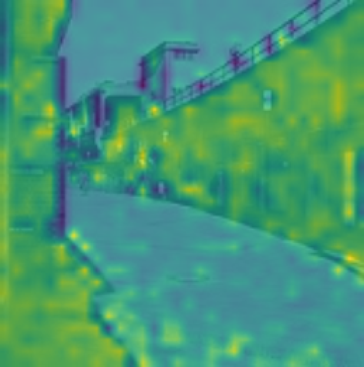

# Scene Classification for Robotics

[](https://www.python.org/downloads/)
[](https://pytorch.org/)
[](LICENSE)

A deep learning project implementing state-of-the-art architectures for scene classification, aimed at enabling robots to understand and adapt to their environments.

**Note**: For the full technical report with detailed architecture descriptions and mathematical formulations, see [report.pdf](report.pdf).

## 📋 Table of Contents
- [Overview](#overview)
- [Motivation](#motivation)
- [Architectures Implemented](#architectures-implemented)
- [Datasets](#datasets)
- [Results](#results)
- [Installation](#installation)
- [Contributing](#contributing)
- [Authors](#authors)
- [References](#references)

## 🎯 Overview

This project explores various deep learning architectures for scene classification, a critical component of **Scene Understanding** that enables robots to comprehend and respond to their environmental context. The goal is to develop models that can identify different environments from visual inputs, allowing robots to seamlessly transition between tasks in diverse and dynamic settings.

## 💡 Motivation

As robots transition from industrial settings to our homes, streets, and workplaces, they need the cognitive ability to:
- Discern the nature of their environment
- Adapt behavior based on context (e.g., moving slowly in monuments, navigating crowded areas)
- Operate across diverse applications without extensive reconfiguration

Beyond robotics, this technology can assist blind people and power various computer vision applications.

## 🏗️ Architectures Implemented

### 1. Convolutional Neural Network (ConvNet)
- **Architecture**: 8 CNN blocks with convolution, ReLU, max pooling, and batch normalization
- **Key Features**: 
  - 3×3 kernels for fine-grained feature detection
  - Progressive feature extraction with spatial downsampling
  - He initialization for optimal weight scaling

### 2. ResNet (Residual Network)
- **Architecture**: ResNet-18 with 4 residual layers
- **Key Innovation**: Skip connections to prevent gradient vanishing
- **Benefits**: Enables deeper networks while maintaining gradient flow

### 3. DenseNet (Densely Connected Network)
- **Architecture**: Custom lightweight DenseNet
- **Key Innovation**: Dense connectivity where each layer receives input from all preceding layers
- **Benefits**: 
  - Feature reuse and strengthened feature propagation
  - Reduced parameters while maintaining performance
  - Alleviates vanishing gradient problem

### 4. Vision Transformer (ViT)
- **Architecture**: Transformer-based architecture with patch embeddings
- **Key Components**:
  - Patchification: Divides images into sequential patches
  - Learnable positional embeddings
  - Multi-head self-attention mechanism
  - GeLU activation functions
- **Trade-off**: Requires more training time but captures long-range dependencies

## 📊 Datasets

### 1. Intel Images Dataset
- Standard benchmark dataset
- Used for initial architecture validation
- **Best Accuracy**: ~90% (ConvNet, ResNet, DenseNet)

### 2. Places Dataset (205 Classes)
- ~300,000 images across 205 scene categories
- Highly diverse and challenging
- **Best Accuracy**: ~40% (DenseNet)

### 3. Places-17 Dataset (Custom)
- Condensed version with 17 broader categories
- Grouped related scenes (e.g., church + cathedral → monument)
- More aligned with robotics applications
- **Best Accuracy**: ~65% (DenseNet)

### Dataset Relabeling Strategy
The 205 original classes were intelligently grouped into 17 categories to better suit practical applications:
- **Monument** (church, cathedral, temple)
- **Public Place** (plaza, street, market)
- **Nature** (forest, mountain, beach)
- And more...


## 📈 Results

### Quantitative Performance

| Architecture | Intel Images | Places-205 | Places-17 |
|-------------|--------------|------------|-----------|
| ConvNet     | ~88%         | ~35%       | ~60%      |
| ResNet-18   | ~90%         | ~38%       | ~63%      |
| DenseNet    | ~90%         | ~40%       | ~65%      |
| ViT         | ~75%         | ~10%*      | ~30%*     |

*ViT requires significantly more training time. Performance was limited by computational constraints.

### Key Findings

1. **DenseNet** achieved the best overall performance on the Places datasets
2. **ResNet** showed strong potential but needed longer training
3. **ViT** demonstrated correct implementation (validated via attention maps) but requires more epochs to converge
4. **Dataset relabeling** improved accuracy by >50% while better aligning with application needs

### Attention Map Visualization

The Vision Transformer's attention mechanism successfully identifies relevant image regions:

```
Yellow regions = High attention
Blue regions = Low attention
```

<div style="display:flex; gap:12px; align-items:center; flex-wrap:wrap">
    <figure style="margin:0; width:48%">
        
        <figcaption style="text-align:center; font-size:0.9em; margin-top:4px">Original image</figcaption>
    </figure>
    <figure style="margin:0; width:48%">
        
        <figcaption style="text-align:center; font-size:0.9em; margin-top:4px">Attention map</figcaption>
    </figure>
</div>

This demonstrates the model's ability to focus on contextually important features.

### Requirements
```
torch>=2.0.0
torchvision>=0.15.0
numpy>=1.24.0
matplotlib>=3.7.0
Pillow>=9.5.0
tqdm>=4.65.0
```

### Data Augmentation

The project includes standard augmentation techniques:
- Random horizontal flips
- Random crops
- Color jittering
- Normalization

## 🔬 Key Insights

### 1. Dataset Understanding is Critical
Thorough dataset exploration revealed that Places-205 contains many closely related classes, leading to the creation of Places-17 for better practical performance.

### 2. Dataset Relabeling Benefits
Simple dictionary-based relabeling can:
- Enhance model performance
- Align outputs with application requirements
- Retain original architecture complexity

### 3. Computational Constraints Matter
- Lighter model versions were necessary
- ResNet emerged as the best architecture given GPU limitations
- ViT shows promise but needs more resources

## 👥 Authors

- **Louis HOGGE** 
- **Julien VANDERHEYDEN**
- **Tom WEBER**

**Course**: INFO8010 - Deep Learning  
**Institution**: University of Liège

## 📚 References

1. Y. Lecun et al. "Gradient-based learning applied to document recognition." Proceedings of the IEEE, 1998.
2. K. Simonyan and A. Zisserman. "Very deep convolutional networks for large-scale image recognition." 2015.
3. K. He et al. "Deep residual learning for image recognition." 2015.
4. G. Huang et al. "Densely connected convolutional networks." CVPR 2017.
5. A. Dosovitskiy et al. "An image is worth 16x16 words: Transformers for image recognition at scale." 2021.

## 📄 License

This project is licensed under the MIT License - see the [LICENSE](LICENSE) file for details.

## 🙏 Acknowledgments

- Places Dataset by MIT
- Intel Images Dataset
- PyTorch team for the excellent deep learning framework
- Course instructors and teaching assistants

